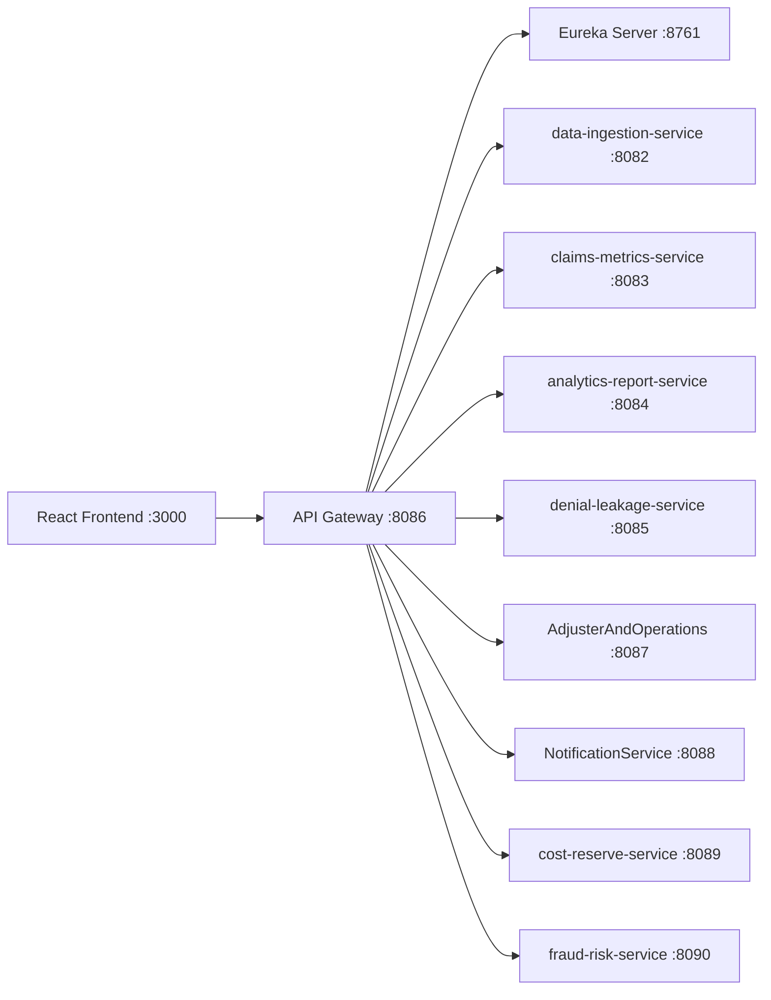

# ClaimInsight360

ClaimInsight360 is a multi-service insurance claims analytics platform built with Spring Boot microservices, Spring Cloud (Eureka + Gateway), MySQL, and React frontends.

## What Is In This Repository

- 10 backend microservices plus service discovery and API gateway
- Multiple frontend implementations (`claiminsight360-frontend`, `claiminsight360-frontend-v2`, `claiminsight360-frontend-v3`)
- Service control scripts for local startup and shutdown
- SQL seed scripts and docs artifacts

## Architecture



## Services And Ports

| Service | Port | Notes |
|---|---:|---|
| `eureka-server` | 8761 | Service registry, start first |
| `api-gateway` | 8086 | Main entry point for frontend and API clients |
| `data-ingestion-service` | 8082 | Feed ingestion and raw claim intake |
| `claims-metrics-service` | 8083 | KPI and claim metrics |
| `analytics-report-service` | 8084 | Reporting and analytics aggregation |
| `denial-leakage-service` | 8085 | Denial and leakage analysis |
| `AdjusterAndOperations` | 8087 | Adjuster and SLA operations |
| `NotificationService` | 8088 | Notification dispatch and tracking |
| `cost-reserve-service` | 8089 | Cost, reserve, and aging endpoints |
| `fraud-risk-service` | 8090 | Fraud scoring and investigations |

## Tech Stack

### Backend
- Java 21
- Spring Boot 3.4.x to 3.5.x (service-dependent)
- Spring Cloud 2024.x and 2025.x (service-dependent)
- Spring Cloud Gateway + Eureka
- MySQL 8+
- Maven

### Frontend
- React 18
- TypeScript
- Vite
- Ant Design / Bootstrap (implementation-dependent)

## Prerequisites

- Java 21+
- Maven 3.8+
- Node.js 18+
- MySQL 8+

## Local Run Guide

### 1. Clone and enter repository

```powershell
git clone https://github.com/UT258/ClaimInsight.git
cd ClaimInsight
```

### 2. Start infrastructure first

- Start MySQL locally
- Optional: run Zipkin at `http://localhost:9411`

### 3. Start backend services (recommended order)

```powershell
# 1) Registry
mvn -pl eureka-server spring-boot:run

# 2) Gateway
mvn -pl api-gateway spring-boot:run

# 3) Business services (any order)
mvn -pl data-ingestion-service spring-boot:run
mvn -pl claims-metrics-service spring-boot:run
mvn -pl analytics-report-service spring-boot:run
mvn -pl denial-leakage-service spring-boot:run
mvn -pl AdjusterAndOperations spring-boot:run
mvn -pl NotificationService spring-boot:run
mvn -pl cost-reserve-service spring-boot:run
mvn -pl fraud-risk-service spring-boot:run
```

### 4. Start frontend

```powershell
cd claiminsight360-frontend
npm install
npm run dev
```

Frontend runs on `http://localhost:3000` and proxies `/api` to gateway `http://localhost:8086`.

## API Gateway Route Groups

The gateway is configured for these API groups:

- `/api/feeds/**`, `/api/ingest/**`
- `/api/kpis/**`, `/api/claim-status/**`
- `/api/costs/**`, `/api/reserves/**`, `/api/aging/**`
- `/api/adjusters/**`, `/api/sla-violations/**`
- `/api/notifications/**`
- `/api/risk-scores/**`, `/api/risk-indicators/**`, `/api/investigations/**`
- `/api/denial-patterns/**`, `/api/leakage-flags/**`
- `/api/reports/**`

## Databases

Several services use MySQL with `createDatabaseIfNotExist=true`. Common DB names in current configs include:

- `claiminsight_db`
- `claims_analytics_report_db`
- `claims_cost_reserve_db`
- `denial_leakage`
- `fraud_risk_db`
- `AdjusterPerformanceDB`
- `NotificationsDB`

Use `seed_data.sql` for sample data bootstrapping where applicable.

## Service Control Scripts

- `START_ALL_SERVICES.ps1`
- `STOP_ALL_SERVICES.ps1`
- `STOP_ALL_SERVICES.bat`

Note: `START_ALL_SERVICES.ps1` currently contains a hardcoded local workspace path. Update its `$workspace` variable before running it in a different environment.

## Useful URLs

- Eureka Dashboard: `http://localhost:8761`
- API Gateway Health: `http://localhost:8086/actuator/health`
- Frontend: `http://localhost:3000`
- Zipkin: `http://localhost:9411`

## Repository Layout

- `eureka-server/`, `api-gateway/`, and business services at repo root
- `claiminsight360-frontend/` as primary React app
- `claiminsight360-frontend-v2/`, `claiminsight360-frontend-v3/`, `frontendwihtoutgragh/` as alternate frontend variants
- `docs/` for design, references, and support materials

## Current Branch And GitHub

- Default working branch used here: `master`
- Remote: `https://github.com/UT258/ClaimInsight.git`
